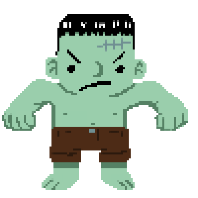

# ⚡️ ReNannyMation ⚡️
Are you responsible? Are you nurturing? You don't scare easy, do you? I might have a game for you...
Your goal is to make sure Adam is happy. You've got one full minute to build up his happiness and fill the progress bar. 

# Background
ReNannyMation is a hand-drawn, pixel-art-based babysitting simulator game for web browsers. With a minute-long time limit for play and short, looping animations, it's an fun way to display simple game building with JavaScript, CSS, and HTML.

# How To Play
Adam will prompt you to let you know what he needs. However, he's very indecisive and will ask you for something new every 2 seconds. When he makes a request, click on the corresponding icon to interact with him. If you click the right one in time, his happiness will increase! But if you miss it or click the wrong one, his happiness will decrease. If he's not happy at the end of a minute, who knows what might happen....

# Game Visuals
|Light Mode | Dark Mode |
| :---------: | :---------: |
||

|Game Play Preview|
| :---------: |
||

| Will you keep him happy? | Or make him angry? |
| | 

# Give It A Shot!
https://renannymation.netlify.app

# Planned Improvements
* Improve mobile layout
* Add more animations to the character during gameplay
* Add multiple difficulty levels with additional timers

# Built With
* HTML
* CSS
* JavaScript
* Bootstrap
* Animate.css
* Fontawesome.com
* Whimsical.com
* Procreate
* Pixel Studio

# Original Wireframe Concept
https://whimsical.com/renannymation-NCMtTXxfa8jzgmiaB13eWR

# Credits
* Background music from https://www.FesliyanStudios.com
* Gameplay sound effects and win music from https://mixkit.co/